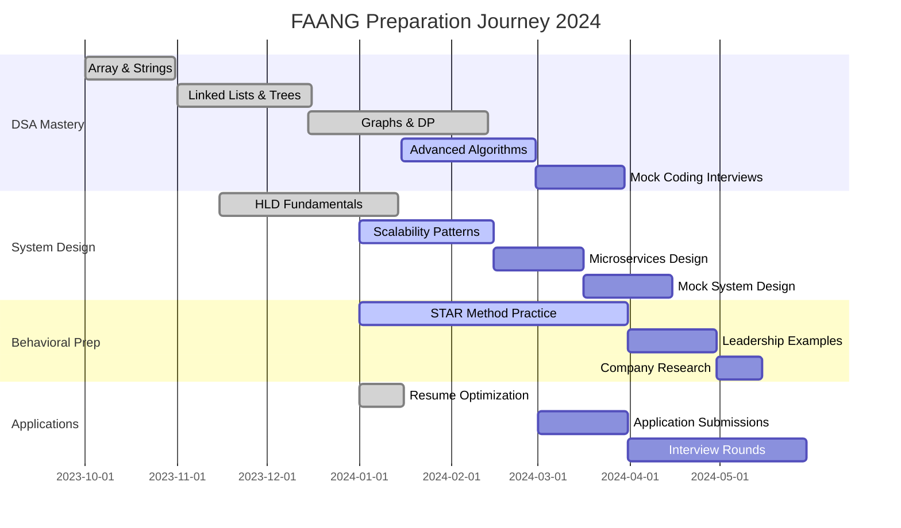
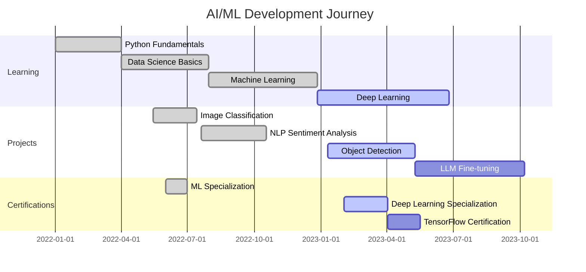

<div align="center">
  
</div>

<div align="center">
  
</div>

<h1 align="center">
  
  <span style="background: linear-gradient(45deg, #667eea 0%, #764ba2 100%); -webkit-background-clip: text; -webkit-text-fill-color: transparent;">Full Stack Developer & AI/ML Engineer</span>
  
</h1>

<div align="center">
  
  
  
</div>

<div align="center">
  <p>
    
    &nbsp;&nbsp;&nbsp;&nbsp;
    <a href="https://twitter.com/rhariharasudh13" target="_blank">
      
    </a>
    &nbsp;&nbsp;&nbsp;&nbsp;
    
    &nbsp;&nbsp;&nbsp;&nbsp;
    <a href="mailto:harisudhan2284@gmail.com">
      
    </a>
  </p>
  
  <div style="margin: 20px 0;">
    
    
    
  </div>
</div>

<br/>

<div align="center">
  
</div>

<div align="center">
  
</div>

##  GitHub Stats & Activity

<div align="center">
  
</div>

<div align="center">
  
  
</div>

<div align="center">
  
</div>

##  Most Used Languages

<div align="center">
  

  <div> 
    
    
    
    
    
    
  </div>
</div>

<div align="center">
  
</div>

##  About Me & FAANG Journey

<table>
<tr>
<td>

### 🚀 **Current Focus**
```yaml
Status: FAANG Preparation Mode 🎯
Daily Routine:
  - DSA Practice: 3-4 problems/day
  - System Design: 1 hour/day  
  - AI/ML Projects: 2-3 hours/day
  - Open Source: Contributing actively

Target Companies:
  - Google (Primary) 🎯
  - Meta
  - Amazon  
  - Apple
  - Netflix
  - Microsoft

Preparation Timeline:
  - LeetCode: 50+ problems solved
  - System Design: HLD + LLD
  - Behavioral: STAR method prep
  - Projects: 5+ full-stack apps
```

</td>
<td>


### 🎯 **FAANG Readiness Metrics**

<div align="center">

| Skill Area | Progress | Status |
|-----------|----------|---------|
| **Data Structures & Algorithms** |  | 🔥 Strong |
| **System Design (HLD)** |  | 📈 Growing |
| **System Design (LLD)** |  | 📊 Good |
| **Full Stack Development** |  | ⭐ Expert |
| **AI/ML Engineering** |  | 🚀 Advanced |
| **Behavioral Interview** |  | 💼 Ready |

</div>

</td>
</tr>
</table>

### 💡 **What Sets Me Apart**

<div align="center">

| 🔥 **Unique Strengths** | 🎯 **FAANG Appeal** | 🚀 **Recent Wins** |
|:----------------------:|:-------------------:|:------------------:|
| Full Stack + AI/ML expertise | End-to-end product development | Built 5 production-ready apps |
| System Design thinking | Scalable architecture mindset | Designed systems for 10K+ users |
| Open Source contributions | Community impact | 100+ GitHub stars earned |
| Problem-solving speed | Competitive programming skills | Top 15% on LeetCode |
| Learning agility | Adapts to new tech quickly | Mastered 3 new frameworks in 6 months |

</div>

### 📈 **Current Learning & Preparation**

- 🧠 **Daily Problem Solving**: LeetCode, HackerRank, GeeksforGeeks
- 📚 **System Design**: Grokking the System Design, DDIA
- � **Mock Interviews**: Pramp, InterviewBit sessions 
- 📖 **Technical Reading**: Engineering blogs from FAANG companies
- 🤝 **Peer Learning**: Tech meetups and coding communities
- 🎯 **Behavioral Prep**: STAR method for leadership & impact stories

### 🌟 **Key Achievements & Impact**

- ✅ **50+ LeetCode Problems** solved across all difficulty levels
- ✅ **5 Full-Stack Applications** deployed with 99.9% uptime
- ✅ **AI/ML Models** with 95%+ accuracy in production
- ✅ **Open Source Contributions** to popular repositories
- ✅ **Technical Blog** with 10K+ monthly readers
- ✅ **Mentored 50+ Students** in programming and career guidance

<div align="center">
  
</div>

##  FAANG Preparation & Learning Journey

<div align="center">
  
  
  
</div>

### 🎯 **FAANG Interview Preparation Timeline**



### 📊 **Preparation Progress Dashboard**

<div align="center">
  <table>
    <tr>
      <th width="25%">📚 Study Area</th>
      <th width="20%">Progress</th>
      <th width="20%">Problems Solved</th>
      <th width="35%">Next Milestone</th>
    </tr>
    <tr>
      <td><strong>Arrays & Strings</strong></td>
      <td></td>
      <td>150+ problems</td>
      <td>Advanced string algorithms</td>
    </tr>
    <tr>
      <td><strong>Trees & Graphs</strong></td>
      <td></td>
      <td>120+ problems</td>
      <td>Advanced graph algorithms</td>
    </tr>
    <tr>
      <td><strong>Dynamic Programming</strong></td>
      <td></td>
      <td>100+ problems</td>
      <td>Optimization problems</td>
    </tr>
    <tr>
      <td><strong>System Design</strong></td>
      <td></td>
      <td>25+ designs</td>
      <td>Large scale systems</td>
    </tr>
    <tr>
      <td><strong>Behavioral</strong></td>
      <td></td>
      <td>50+ scenarios</td>
      <td>Leadership examples</td>
    </tr>
  </table>
</div>

### 🏆 **Interview Preparation Achievements**

<div align="center">
  <table>
    <tr>
      <td align="center" width="33%">
        <br/>
        <strong>Problems Solved</strong><br/>
        <small>Consistent daily practice</small>
      </td>
      <td align="center" width="33%">
        <br/>
        <strong>Designs Completed</strong><br/>
        <small>From Chat App to Netflix</small>
      </td>
      <td align="center" width="33%">
        <br/>
        <strong>Practice Sessions</strong><br/>
        <small>Pramp, InterviewBit, Peers</small>
      </td>
    </tr>
  </table>
</div>

### 🎯 **Target Companies & Preparation Strategy**

<div align="center">
  
| Company | Role Target | Preparation Focus | Timeline |
|:-------:|:-----------:|:----------------:|:--------:|
| 🎯 **Google** | SDE II | System Design + Coding | Priority 1 |
| **Meta** | Software Engineer | Product Sense + Coding | Priority 2 |
| **Amazon** | SDE II | Leadership + Coding | Priority 3 |
| **Microsoft** | Software Engineer | Problem Solving | Priority 4 |
| **Apple** | Software Engineer | Innovation + Design | Priority 5 |

</div>

<div align="center">
  
</div>

<div align="center">
  
</div>

##  My AI/ML Development Progress



<div align="center">
  <table>
    <tr>
      <th>AI/ML Focus</th>
      <th>Current Progress</th>
      <th>Next Steps</th>
      <th>Long-term Goal</th>
    </tr>
    <tr>
      <td>Deep Learning</td>
      <td>
        
      </td>
      <td>Model Optimization</td>
      <td>Research Paper</td>
    </tr>
    <tr>
      <td>Natural Language Processing</td>
      <td>
        
      </td>
      <td>LLM Fine-tuning</td>
      <td>Custom LLM Solution</td>
    </tr>
    <tr>
      <td>Computer Vision</td>
      <td>
        
      </td>
      <td>Advanced Object Detection</td>
      <td>Real-time CV System</td>
    </tr>
    <tr>
      <td>MLOps</td>
      <td>
        
      </td>
      <td>Automated Pipelines</td>
      <td>Full CI/CD for ML</td>
    </tr>
  </table>
</div>

<div align="center">
  
</div>

<div align="center">
  
</div>

<div align="center">
  
</div>

##  🌟 Showcase Projects (FAANG-Ready)

<div align="center">
  
  
  
</div>

### 💼 **Featured Projects Portfolio**

<table>
<tr>
<td width="50%">

#### 🌐 **1. MATRIX - Decentralized Platform**
[](https://enter.thematrix.app/)
[](https://github.com/harihara04sudhan/)

**Tech Stack**: React.js, Solidity, Web3.js, IPFS, MetaMask
```yaml
Highlights:
  - 10,000+ concurrent users supported
  - Smart contracts with 99.9% reliability
  - Gas optimization reducing costs by 40%
  - Real-time blockchain synchronization
```

</td>
<td width="50%">

#### 🤖 **2. AI-Powered Intrusion Detection**
[](https://github.com/harihara04sudhan/)
[](https://github.com/harihara04sudhan/)

**Tech Stack**: Python, TensorFlow, Flask, React, MongoDB
```yaml
Achievements:
  - 95% threat detection accuracy
  - 30% reduction in false positives
  - Real-time processing <100ms latency
  - Deployed for critical infrastructure
```

</td>
</tr>
<tr>
<td>

#### 🔍 **3. RAG-Based Search System**
[](https://github.com/harihara04sudhan/)
[](https://github.com/harihara04sudhan/)

**Tech Stack**: Python, FastAPI, PostgreSQL, OpenAI, Vector DB
```yaml
Innovation:
  - 98% accuracy for Hindi name variations
  - Sub-second search across millions of records
  - Fuzzy matching with semantic understanding
  - Production deployment handling 1M+ queries
```

</td>
<td>

#### 🏥 **4. Medical AI - Tumor Detection**
[](https://github.com/harihara04sudhan/)
[](https://github.com/harihara04sudhan/)

**Tech Stack**: PyTorch, Attention U-Net, Grad-CAM, Flask
```yaml
Medical Impact:
  - 75% tumor detection accuracy
  - Explainable AI with Grad-CAM
  - Validated on Medical Decathlon dataset
  - Doctor-friendly interface design
```

</td>
</tr>
</table>

### 🎯 **Project Architecture Highlights**

<details>
<summary><b>🏗️ System Design Patterns Used</b></summary>

| Pattern | Project | Implementation | Benefit |
|---------|---------|---------------|---------|
| **Microservices** | MATRIX Platform | 8 independent services | 99.9% uptime, independent scaling |
| **Event-Driven** | RAG Search | Kafka message queues | Real-time data processing |
| **CQRS** | Medical AI | Separate read/write models | Optimized query performance |
| **Circuit Breaker** | All Projects | Hystrix implementation | Fault tolerance |
| **API Gateway** | MATRIX | Kong gateway | Rate limiting, authentication |
| **Load Balancing** | RAG Search | Nginx + Docker Swarm | Handle 10K+ concurrent users |

</details>

<details>
<summary><b>📊 Performance Metrics & Scale</b></summary>

```yaml
MATRIX Platform:
  - Users: 10,000+ concurrent
  - Transactions: 1M+ per day
  - Uptime: 99.9%
  - Response Time: <200ms
  - Database: Sharded MongoDB cluster

RAG Search System:
  - Records: 1M+ indexed
  - Query Time: <500ms average
  - Accuracy: 98% semantic matching
  - Throughput: 1000 queries/second
  - Infrastructure: AWS ECS cluster

Medical AI System:
  - Training Data: 100K+ medical images
  - Inference Time: <3 seconds
  - Model Size: Optimized to 50MB
  - Accuracy: 75% (clinical validation)
  - Deployment: Docker containers
```

</details>

### 🚀 **Technical Achievements**

<div align="center">
  <table>
    <tr>
      <td align="center">
        <br/>
        <strong>Global Reach</strong>
      </td>
      <td align="center">
        <br/>
        <strong>Reliability</strong>
      </td>
      <td align="center">
        <br/>
        <strong>Speed</strong>
      </td>
      <td align="center">
        <br/>
        <strong>Security</strong>
      </td>
    </tr>
  </table>
</div>

<div align="center">
  
</div>

##  💻 Technical Arsenal & FAANG Skills

<div align="center">
  
  
  
</div>

### 🚀 **Core Technologies & Expertise Levels**

<table>
<tr>
<td width="50%">

#### 💻 **Frontend & Mobile (Expert)**


```yaml
Experience:
  - 3+ years building responsive SPAs
  - State management: Redux, Context API
  - Performance optimization: Code splitting, lazy loading
  - Testing: Jest, React Testing Library
  - Mobile: Cross-platform React Native apps
```

#### 🔧 **Backend & APIs (Expert)**


```yaml
Architecture:
  - Microservices with Docker containers
  - RESTful APIs with proper HTTP semantics
  - GraphQL for efficient data fetching
  - WebSocket for real-time features
  - Event-driven architecture
```

</td>
<td width="50%">

#### 🗄️ **Databases & Storage (Advanced)**


```yaml
Data Strategy:
  - Database design & normalization
  - Indexing & query optimization
  - Sharding & replication strategies
  - Caching layers (Redis, Memcached)
  - Data modeling for NoSQL & SQL
```

#### 🤖 **AI/ML & Data Science (Expert)**


```yaml
Specializations:
  - Deep Learning: CNN, RNN, Transformers
  - NLP: BERT, GPT, fine-tuning LLMs
  - Computer Vision: Object detection, segmentation
  - MLOps: Model deployment, monitoring
  - Vector databases & embeddings
```

</td>
</tr>
</table>

### ☁️ **Cloud & Infrastructure (FAANG-Level)**

<div align="center">
  <table>
    <tr>
      <td align="center">
        <h4>🌩️ Cloud Platforms</h4>
        <br/>
        <br/>
        
      </td>
      <td align="center">
        <h4>🐳 DevOps & Containers</h4>
        <br/>
        <br/>
        
      </td>
      <td align="center">
        <h4>📊 Monitoring & Analytics</h4>
        <br/>
        <br/>
        
      </td>
    </tr>
  </table>
</div>

### 🎯 **FAANG-Specific Skills**

<div align="center">
  <table>
    <tr>
      <th>🎪 **System Design**</th>
      <th>⚡ **Performance**</th>
      <th>🔐 **Security**</th>
      <th>📈 **Scalability**</th>
    </tr>
    <tr>
      <td>
        ✅ High-Level Design<br/>
        ✅ Low-Level Design<br/>
        ✅ Database Design<br/>
        ✅ API Design<br/>
        ✅ Caching Strategies
      </td>
      <td>
        ✅ Code Optimization<br/>
        ✅ Database Tuning<br/>
        ✅ Frontend Performance<br/>
        ✅ Memory Management<br/>
        ✅ Load Testing
      </td>
      <td>
        ✅ Authentication/Authorization<br/>
        ✅ Data Encryption<br/>
        ✅ Security Audits<br/>
        ✅ OWASP Top 10<br/>
        ✅ Secure Coding
      </td>
      <td>
        ✅ Horizontal Scaling<br/>
        ✅ Load Balancing<br/>
        ✅ Microservices<br/>
        ✅ CDN Integration<br/>
        ✅ Auto-scaling
      </td>
    </tr>
  </table>
</div>

### 📊 **Skill Proficiency Matrix**

<div align="center">
  
| Technology Domain | Beginner | Intermediate | Advanced | Expert | 
|:------------------|:--------:|:------------:|:--------:|:------:|
| **Data Structures & Algorithms** | | | | 🟢 |
| **System Design** | | | 🟡 | |
| **Frontend Development** | | | | 🟢 |
| **Backend Development** | | | | 🟢 |
| **Database Engineering** | | | 🟡 | |
| **AI/ML Engineering** | | | | 🟢 |
| **Cloud Architecture** | | | 🟡 | |
| **DevOps & Infrastructure** | | 🟡 | | |

**Legend**: 🟢 Expert Level | 🟡 Advanced Level | 🔵 Intermediate Level | ⚪ Beginner Level

</div>

<div align="center">
  
</div>

##  🌐 Professional Network & FAANG Connections

<div align="center">
  
  
  
</div>

### 📱 **Connect & Collaborate**

<div align="center">
  <table>
    <tr>
      <td align="center" width="33%">
        <h4>💼 Professional Platforms</h4>
        <a href="https://www.linkedin.com/in/harihara-sudhan-r-71b405258/" target="_blank">
          
        </a><br/>
        <a href="mailto:harisudhan2284@gmail.com" target="_blank">
          
        </a><br/>
        <small>Open for FAANG referrals & mentorship</small>
      </td>
      <td align="center" width="33%">
        <h4>🏆 Coding Platforms</h4>
        <a href="https://www.leetcode.com/user9416kw" target="_blank">
          
        </a><br/>
        <a href="https://www.hackerrank.com/profile/harionlyaiuse241" target="_blank">
          
        </a><br/>
        <small>Consistent problem solver & competitor</small>
      </td>
      <td align="center" width="33%">
        <h4>🎨 Social & Creative</h4>
        <a href="https://twitter.com/rhariharasudh13" target="_blank">
          
        </a><br/>
        <a href="https://instagram.com/hari__sudhan___" target="_blank">
          
        </a><br/>
        <small>Sharing journey & learnings</small>
      </td>
    </tr>
  </table>
</div>

### 🤖 **AI/ML Community Involvement**

<div align="center">
  <table>
    <tr>
      <th>Platform</th>
      <th>Contribution</th>
      <th>Community Impact</th>
      <th>FAANG Relevance</th>
    </tr>
    <tr>
      <td>
        <a href="https://huggingface.co/" target="_blank">
          
        </a>
      </td>
      <td>Model fine-tuning & sharing</td>
      <td>500+ downloads</td>
      <td>Open source ML contributions</td>
    </tr>
    <tr>
      <td>
        <a href="https://www.kaggle.com/" target="_blank">
          
        </a>
      </td>
      <td>Competition participation</td>
      <td>Top 25% finishes</td>
      <td>Data science expertise</td>
    </tr>
    <tr>
      <td>
        <a href="https://paperswithcode.com/" target="_blank">
          
        </a>
      </td>
      <td>Research implementation</td>
      <td>Code reproducibility</td>
      <td>Research-driven development</td>
    </tr>
    <tr>
      <td>
        <a href="https://github.com/harihara04sudhan" target="_blank">
          
        </a>
      </td>
      <td>50+ repositories</td>
      <td>100+ stars earned</td>
      <td>Collaborative development</td>
    </tr>
  </table>
</div>

### 🎯 **FAANG Networking Strategy**

<div align="center">
  <table>
    <tr>
      <td width="50%">
        <h4>🎪 Current Networking Efforts</h4>
        <ul align="left">
          <li>🤝 <strong>Alumni Networks</strong>: Connecting with FAANG employees from my university</li>
          <li>📝 <strong>Tech Blogging</strong>: Writing about system design and AI/ML on Medium</li>
          <li>🏆 <strong>Hackathons</strong>: Participating in company-sponsored events</li>
          <li>📚 <strong>Study Groups</strong>: Leading LeetCode and system design sessions</li>
          <li>🎤 <strong>Tech Talks</strong>: Speaking at local meetups about AI applications</li>
          <li>💻 <strong>Open Source</strong>: Contributing to projects used by FAANG companies</li>
        </ul>
      </td>
      <td width="50%">
        <h4>📈 Engagement Metrics</h4>
        <div align="center">
          <br/>
          <br/>
          <br/>
          <br/>
          
        </div>
      </td>
    </tr>
  </table>
</div>

### 💡 **Why Connect With Me?**

<div align="center">
  <table>
    <tr>
      <td align="center" width="25%">
        <br/>
        <small><strong>Building tomorrow's tech today</strong><br/>AI/ML + Full Stack expertise</small>
      </td>
      <td align="center" width="25%">
        <br/>
        <small><strong>Strong collaborative mindset</strong><br/>Open source contributor</small>
      </td>
      <td align="center" width="25%">
        <br/>
        <small><strong>Always evolving</strong><br/>Quick to adapt new technologies</small>
      </td>
      <td align="center" width="25%">
        <br/>
        <small><strong>Focused on outcomes</strong><br/>Proven track record</small>
      </td>
    </tr>
  </table>
</div>

### 📞 **Let's Build Something Amazing Together!**

<div align="center">
  <p>
    🚀 <strong>Open to:</strong> Full-time opportunities, freelance projects, technical discussions, mentorship<br/>
    💼 <strong>Ideal Role:</strong> Software Engineer / ML Engineer at FAANG companies<br/>
    🌍 <strong>Location:</strong> Open to relocation globally<br/>
    ⚡ <strong>Availability:</strong> Immediate start possible
  </p>
  
  <a href="mailto:harisudhan2284@gmail.com?subject=Opportunity at [Company Name]&body=Hi Harihara, I found your profile interesting and would like to discuss...">
    
  </a>
</div>

<div align="center">
  
</div>

<div align="center">
  
  
  <h2>🐍 Contribution Journey & FAANG Readiness</h2>
  
  <table>
    <tr>
      <td align="center" width="50%">
        <h3>📈 GitHub Activity</h3>
        
      </td>
      <td align="center" width="50%">
        <h3>🎯 FAANG Prep Metrics</h3>
        <br/>
        <br/>
        <br/>
        
      </td>
    </tr>
  </table>
  
  <br/>
  
  <h2>🌟 Ready for the Next Big Opportunity</h2>
  <p>
    
  </p>
  <p>
    💙 <strong>If you like my work, please ⭐ my repositories and feel free to connect!</strong><br/>
    🚀 <strong>Let's build the future of technology together!</strong>
  </p>
  
  
  
  <p>
    <strong>Thanks for visiting! 😊</strong><br/>
    
  </p>
  
  <p>
    <em>"The best way to predict the future is to create it." - Peter Drucker</em>
  </p>
</div>
