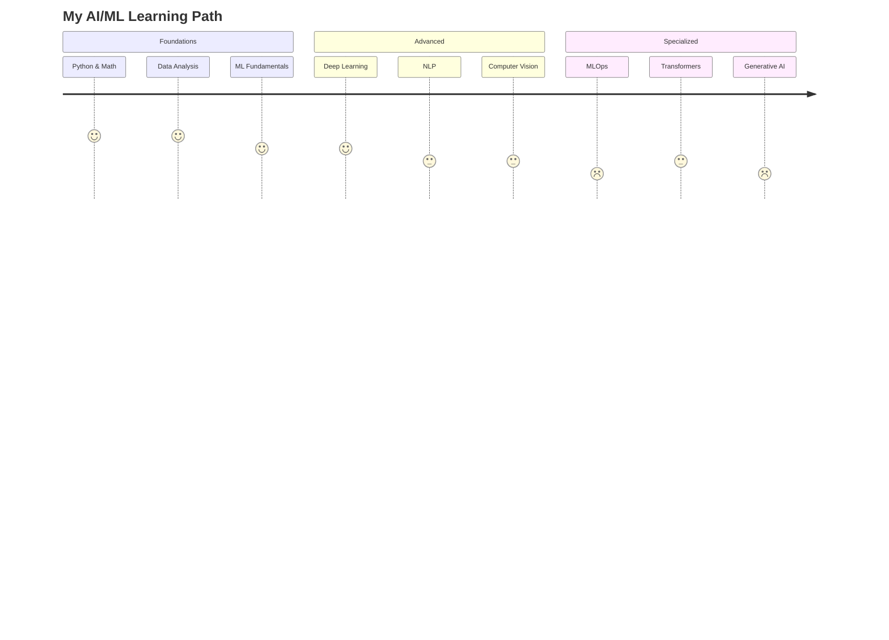
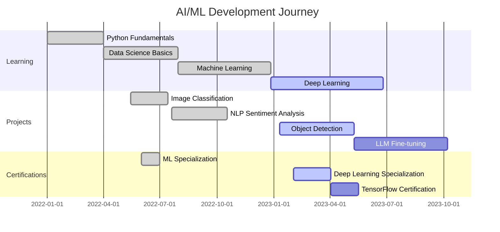

  

<h3 align="center">
  
  Full Stack Developer & AI/ML Engineer specializing in deep learning models 
  👋
</h3>

  

    
    &nbsp;&nbsp;&nbsp;&nbsp;
    
    &nbsp;&nbsp;&nbsp;&nbsp;
    
    &nbsp;&nbsp;&nbsp;&nbsp;
    
  

 

  

  

##  GitHub Stats & Activity

  

  
  

  

##  Most Used Languages

  

  
 
    
    
    
    
    
    
  

  

##  About Me

- 🚀 I'm currently working on **[MATRIX](https://enter.thematrix.app/)**

- 🧠 I'm currently learning **Blockchain, AI and ML with Deep Learning**

- 🤝 I'm looking for collaboration opportunities, especially at **Google**

- 💡 I need assistance with **Backend Development**

- 💬 Ask me about **React**

- 📧 How to reach me: **[harisudhan2284@gmail.com](mailto:harisudhan2284@gmail.com)**

- ⚡ Fun fact: **I can adapt and thrive in any situation!**

- 📄 Check my projects below

  

##  AI/ML Learning Journey

  <table>
    <tr>
      <td align="center">🏆 <b>Recent Achievements</b>:</td>
    </tr>
    <tr>
      <td>✅ Completed <b>Deep Learning Specialization</b> on Coursera</td>
    </tr>
    <tr>
      <td>✅ Deployed a fine-tuned model on Hugging Face Hub</td>
    </tr>
    <tr>
      <td>✅ Built a real-time object detection system</td>
    </tr>
    <tr>
      <td>✅ Participated in Kaggle competitions</td>
    </tr>
  </table>

  

  

##  My AI/ML Development Progress

  <table>
    <tr>
      <th>AI/ML Focus</th>
      <th>Current Progress</th>
      <th>Next Steps</th>
      <th>Long-term Goal</th>
    </tr>
    <tr>
      <td>Deep Learning</td>
      <td>
        
      </td>
      <td>Model Optimization</td>
      <td>Research Paper</td>
    </tr>
    <tr>
      <td>Natural Language Processing</td>
      <td>
        
      </td>
      <td>LLM Fine-tuning</td>
      <td>Custom LLM Solution</td>
    </tr>
    <tr>
      <td>Computer Vision</td>
      <td>
        
      </td>
      <td>Advanced Object Detection</td>
      <td>Real-time CV System</td>
    </tr>
    <tr>
      <td>MLOps</td>
      <td>
        
      </td>
      <td>Automated Pipelines</td>
      <td>Full CI/CD for ML</td>
    </tr>
  </table>

  

  

  

##  Featured Projects

  
  
  

| Project | Tech Stack | Description | Link |
|---------|-----------|-------------|------|
| **Decentralized Crowdfunding DApp** | React.js, Solidity, Web3 | Web3-based crowdfunding platform enabling secure and transparent fundraising with smart contracts | [GitHub](https://github.com/harihara04sudhan/) |
| **Fuzzy Name Matching with RAG Search** | Python, FastAPI, PostgreSQL | RAG-based search system for police records with 98% accuracy for Hindi name variations | [GitHub](https://github.com/harihara04sudhan/) |
| **Intrusion Detection System** | FCNN, GAN, React, Flask | IDS for IEC-61850 protocol in substations with 95% detection accuracy and 30% reduced false positives | [GitHub](https://github.com/harihara04sudhan/) |
| **Tumor Detection in Pancreatic MRIs** | Attention U-Net, Grad-CAM | Deep learning model for pancreatic tumor detection with 75% accuracy and enhanced explainability | [GitHub](https://github.com/harihara04sudhan/) |
| **UJAL - AI Support for Women** | React, FastAPI, MongoDB, Clerk | AI platform providing SOS messaging via steganography, mental health chatbot, and legal rights assistance | [GitHub](https://github.com/harihara04sudhan/) |

📊 AI/ML Project Metrics

  
| Project | Accuracy | Detection Rate | False Positive Reduction | Dataset |
|---------|----------|----------|------------|---------|
| Fuzzy Name Matching | 98% | - | 30% | Police Records |
| Intrusion Detection System | 95% | - | 30% | IEC-61850 Protocol Data |
| Pancreatic Tumor Detection | 75% | - | - | Medical Decathlon |
| UJAL SOS System | - | 90% | - | Custom Dataset |
  

  

##  Skills & Technologies

  
  ### 💻 Frontend Development

  
  
  
  
  

  ### 🔙 Backend Development

  
  
  
  
  

  ### 🤖 AI/ML & Data Science

  
  
  
  
  
  
    
  
  
  
  
  

  

    <h4>🔍 AI/ML Skills Breakdown</h4>
    <table>
      <tr>
        <td>
          
        </td>
      </tr>
    </table>
  

  ### ☁️ Cloud & DevOps

  
  
  
  

  ### 🔧 Tools & Others

  
  
  
  

  

##  Connect with me

  

    
    &nbsp;&nbsp;&nbsp;&nbsp;
    
    &nbsp;&nbsp;&nbsp;&nbsp;
    
       
    
    &nbsp;&nbsp;&nbsp;&nbsp;
    
    &nbsp;&nbsp;&nbsp;&nbsp;
    
  

  
  <h3>🌐 AI Community Involvement</h3>
  

    
    &nbsp;&nbsp;&nbsp;&nbsp;
    
    &nbsp;&nbsp;&nbsp;&nbsp;
    
  

  

  <h2>🐍 My Contributions 🐍</h2>
   
  
  
  
     

  
💙 If you like my projects, Give them ⭐ and Share them!

  
Thanks for visiting! 😊

  

